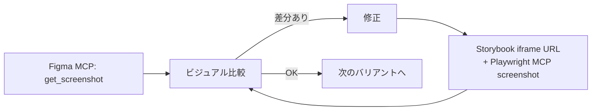
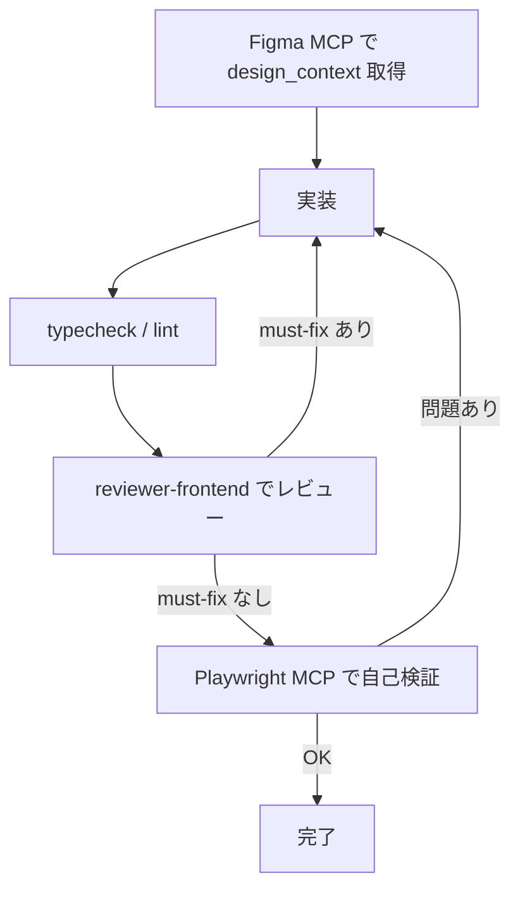

## はじめに

AI コーディングエージェントに「Figma のデザイン通りに作って」と頼むと、それっぽい見た目はすぐに出てきます。ただ、出来上がったコードをよく見ると──

- デザイントークンを無視してハードコードされた色やフォントサイズ
- 「Figma では同じコンポーネント」なのに、コードでは別物として再実装されている
- 1 つの画面をまとめて AI に渡してしまい、生成されるコードが巨大化して収拾がつかない

といった手戻りのある実装になりがちです。

これらはプロンプトの工夫だけで改善するのは難しいと感じています。Figma 側のファイル構造・MCP の呼び出し手順・コンポーネント再利用の仕組み・検証フローまで含めて仕組みで担保しないと、AI の出力は安定しません。

Figma と Anthropic はそれぞれ [Figma MCP 公式ガイド](https://github.com/figma/mcp-server-guide) と [Claude Code ベストプラクティス](https://code.claude.com/docs/en/best-practices) として、この種の問題に対する設計原則を既に公開しています。自己流で試行錯誤するよりも、これらに素直に従うのが筋が良いと考えています。

https://github.com/figma/mcp-server-guide

https://code.claude.com/docs/en/best-practices

本記事では、これらの一次情報をベースに、プロジェクトで実際に回している **5 つのプラクティス** を紹介します。

1. デザインシステム規約をルールファイル化する
2. 共通コンポーネントは Code Connect を活用する
3. Storybook でコンポーネント単位にビジュアル検証する
4. Playwright MCP で実装直後に自己検証する
5. レビューはサブエージェントに分離する

前提として Figma MCP と公式プラグインの全体像に触れてから、各プラクティスに入ります。

## 1. Figma MCP のおさらい

Figma MCP は、Figma が公式に提供する [Model Context Protocol](https://modelcontextprotocol.io/) サーバーです。Claude Code や Cursor のような MCP クライアントから Figma のデザインファイルにアクセスし、構造化された情報を取り出せます。

https://modelcontextprotocol.io/

### 2 種類のサーバー構成

Figma MCP には **Remote（ホスト型）** と **Desktop（ローカル）** の 2 つの構成があり、役割がはっきり分かれています。

| 種別                    | エンドポイント                    | 実行場所                           | 備考                                                                 |
| ----------------------- | --------------------------------- | ---------------------------------- | -------------------------------------------------------------------- |
| Remote MCP server       | `https://mcp.figma.com/mcp`       | Figma ホスト型                     | 公式推奨。Figma デスクトップアプリ不要                               |
| Desktop MCP server      | `http://127.0.0.1:3845/mcp`       | Figma デスクトップアプリ内で起動 | 「Dev Mode MCP Server」と呼ばれるローカル版。特定の組織要件向け      |

公式ドキュメントは [Remote MCP Server](https://developers.figma.com/docs/figma-mcp-server/remote-server-installation/) の利用を強く推奨しています。Desktop 版は Figma デスクトップアプリの Dev Mode から有効化する必要があり、機能面でも Remote 版のほうが広くカバーされています。

https://developers.figma.com/docs/figma-mcp-server/remote-server-installation/

### 主なツール

公式ガイドで中心的に扱われている読み取り系のツールは次のとおりです（書き込み系は後述の `figma-use` が中心）。

| ツール                 | 役割                                                                                          |
| ---------------------- | --------------------------------------------------------------------------------------------- |
| `get_design_context`   | 対象ノードの構造化されたデザイン情報を取得（React + Tailwind の参考コードを含む）             |
| `get_metadata`         | 高レベルなノードマップを取得（レスポンスが大きすぎる場合のフォールバック）                    |
| `get_screenshot`       | 対象ノードのスクリーンショットを取得（ビジュアルリファレンス）                                |
| `get_variable_defs`    | 対象ノードで使われている変数（色・スペーシング・タイポグラフィ）の名前と値を取得              |
| `get_code_connect_map` | Figma ノード ID とコードベース上のコンポーネントの対応マップを取得                            |

### セットアップ

Claude Code で Remote MCP を使う場合、公式プラグイン（後述）経由が最も簡単です。

```bash
claude plugin install figma@claude-plugins-official
```

プラグインを使わずに手動で入れる場合は、Claude Code CLI から次のコマンドで登録できます。

```bash
claude mcp add --scope user --transport http figma https://mcp.figma.com/mcp
```

VS Code / Cursor / Codex など他クライアントの手順は、[公式インストールガイド](https://developers.figma.com/docs/figma-mcp-server/remote-server-installation/) を参照してください。

:::message
Figma MCP の利用には Figma 側の認証が必要です。加えて、プランとシート種別によってツール呼び出しのレート制限があり、Code Connect のような一部機能は **Organization / Enterprise プラン** 限定です。実運用に入る前にチームの契約状況を確認することをおすすめします。詳細は [Figma MCP 公式ドキュメント](https://developers.figma.com/docs/figma-mcp-server/) と [Code Connect ドキュメント](https://www.figma.com/code-connect-docs/) を参照してください。
:::

## 2. Figma MCP 公式ガイドについて

Figma は [figma/mcp-server-guide](https://github.com/figma/mcp-server-guide) というリポジトリで、Figma MCP をコーディングエージェントから使う際のベストプラクティスを公開しています。

https://github.com/figma/mcp-server-guide

このガイドを読むと、Figma 側が期待している使い方を知ることができます。

### 要点

公式ガイドから特に重要な項目を抜粋します（見出しは原文ママ）。

#### Structure your Figma file for better code

- 再利用される要素（ボタン、カード、入力）は **Figma でコンポーネント化** する
- **変数** を活用して spacing / color / radius / typography を管理する
- グループ名は `Group 5` ではなく `CardContainer` のような **セマンティックな名前** を付ける
- Auto Layout を使って **レスポンシブ意図** を伝える
- **Code Connect** で Figma コンポーネントとコードベース上のコンポーネントを結びつける

AI 以前のデザインファイル設計の話ですが、**実装エージェントの出力品質はファイル構造に強く依存する** ため、ここは土台として効いてきます。

#### Ensure consistently good output

公式が推奨する MCP 呼び出しフロー：

1. `get_design_context` で構造化データを取得
2. レスポンスが大きすぎる場合は `get_metadata` でノードマップを取得 → 必要な子ノードのみ再取得
3. `get_screenshot` でビジュアルリファレンスを取得
4. **デザインコンテキストとスクリーンショットの両方が揃ってから実装を開始する**

> This is a reference, not final code.

ガイドでは、`get_design_context` が返す React + Tailwind のコードを **リファレンス（振る舞いと見た目の表現）** として扱い、プロジェクトのフレームワーク・規約・トークンシステムに変換することが明示されています。「生成されたコードをそのまま貼る」運用はアンチパターンです。

#### Break down large selections

- 画面丸ごとを 1 回の `get_design_context` に渡さない
- **コンポーネント単位** に分解して呼び出す
- レスポンスが肥大化するとエージェントのコンテキストを食い潰し、出力品質が落ちる

#### `get_variable_defs`（変数の直接参照）

- Figma 側で定義された変数名と値を直接取得し、**ハードコード値を避ける**
- プロンプト例: *"Get the variable names and values used in this frame."*
- コードベース側に対応するトークンがあれば、そちらにマップする

#### 画像・アセットの扱い

- Figma MCP が localhost ソースを返した場合、**そのまま使う**
- プレースホルダーを作らない
- 新しいアイコンパッケージをインストールしない

#### Link components to your codebase via Code Connect

> This is the best way to get consistent component reuse in code. Without it, the model is guessing.

Code Connect は Figma コンポーネントとコードベースのコンポーネントを結びつける仕組みです。これがないと、エージェントは毎回 Figma のレイヤーを「推測で」再実装してしまいます（詳細は 4-2 で）。

## 3. Figma 公式プラグイン（スキル）の解説

Figma は Claude Code 向けの公式プラグインを配布しています。インストールは以下の 1 コマンドです。

```bash
claude plugin install figma@claude-plugins-official
```

インストールすると、MCP サーバー設定に加えて、いくつかの **Agent Skill** が使えるようになります。Agent Skill は Claude Code の標準的な拡張ポイントで、特定のトリガーに応じて専用ワークフローを起動します。

### 含まれるスキル一覧

本稿執筆時点（2026 年 4 月）で同プラグインに含まれる主なスキルは次のとおりです。

| スキル名                           | 用途                                                                       |
| ---------------------------------- | -------------------------------------------------------------------------- |
| `figma-implement-design`           | Figma デザイン → コード変換。1:1 のビジュアル忠実度を目指す構造化ワークフロー |
| `figma-create-design-system-rules` | プロジェクト固有のデザインシステムルールを生成                             |
| `figma-code-connect`               | Code Connect テンプレート（`.figma.tsx` 等）の作成・保守                   |
| `figma-generate-library`           | コードベースから Figma 側に本格的なデザインシステムを構築                  |
| `figma-generate-design`            | コードやディスクリプションから Figma 上に画面（ページ）を組み立てる        |
| `figma-use`                        | `use_figma` ツール（Figma Plugin API を JS で実行）を使う際の必須プリフライト |

おおまかに分類すると、`figma-implement-design` と `figma-create-design-system-rules` が **デザイン → コード**、`figma-code-connect` が **両者間のマッピング**、`figma-generate-design` / `figma-generate-library` / `figma-use` が **コード → デザイン** のワークフローを担います。

本記事では、フロントエンド実装フロー（デザイン → コード方向）に直結する `figma-implement-design` / `figma-create-design-system-rules` / `figma-code-connect` を中心に扱います。

## 4. プラクティス

前述の公式ガイドとスキル群をベースに、品質を担保するために現場で回している 5 つのプラクティスを紹介します。

### 4-1. デザインシステム規約をルールファイル化する

AI コーディングエージェントに毎回同じ品質で実装させるには、**プロジェクト固有の規約** を明文化して、自動で読み込ませる必要があります。

Anthropic の [Claude Code best practices](https://code.claude.com/docs/en/best-practices) および [メモリ管理](https://code.claude.com/docs/en/memory) のガイドでは、ルールの管理について次の方向性が推奨されています。

- `CLAUDE.md` は短く、広く適用されるものだけ書く
- ドメイン固有の詳細ルールは別ファイル（`.claude/rules/` など）に切り出す
- 肥大化すると AI が指示を無視しやすくなる

つまり「デザインシステムのルールだけ書いた専用ファイル」を、呼び出されるべきタイミングで自動ロードされる形に整備する、というのが正攻法です。

ここで活躍するのが `figma-create-design-system-rules` スキルです（Figma MCP の `create_design_system_rules` ツールに対応）。

#### スキルが生成するもの

スキルを起動すると、プロジェクト構成を解析したうえで **デザインシステム用のルールファイル** がひな形として生成されます。出力の保存先は公式ドキュメントでも「`rules/` または `instructions/` ディレクトリなど、エージェントが参照できる場所に保存する」とされており、特定のファイル名に強制されるわけではありません。

実プロジェクトでは、Claude Code の場合、生成されたひな形を出発点に **役割別のルールファイルに分割** して `.claude/rules/` 配下に配置しています。たとえば：

- `frontend.md`: フロントエンド全般の規約
- `figma-design-system.md`: トークン、コンポーネント配置、Tailwind 変換ルール

ルール分割の具体的な方針は、[Claude Code のメモリ管理ドキュメント](https://code.claude.com/docs/en/memory) が参考になります。役割ごとに最小ファイルに分ける構成は、サブエージェント（後述 4-5）との相性も良いです。

#### ルールに書くべき内容

公式ガイドに沿って、最低限書いておくと効果が高いのは次の項目です。

- **MCP 呼び出しの必須フロー**: `get_design_context` → 必要なら `get_metadata` → `get_screenshot` → 実装開始
- **トークン変換ルール**: Figma 変数名からコード側トークンへのマッピング規則
- **コンポーネント配置ルール**: 新規作成前に既存コンポーネントを確認すること、配置先ディレクトリ、命名規則
- **アセット方針**: localhost ソースをそのまま使う、新規アイコンパッケージの追加禁止

これらを **毎回プロンプトに書く** のではなく、**ルールファイルとして永続化する** のがポイントです。ルール化してしまえば、誰が Claude Code を使っても同じ手順で実装が走ります。

### 4-2. 共通コンポーネントは Code Connect を活用する

Figma MCP ガイドが「もっとも効果的なコンポーネント再利用の方法」として推奨しているのが [Code Connect](https://www.figma.com/code-connect-docs/) です。

https://www.figma.com/code-connect-docs/

#### Code Connect が解く問題

Code Connect を入れない状態だと、エージェントは Figma のノード構造から React コンポーネントを新規実装する可能性があります。結果として：

- 社内で `Button` コンポーネントがあるのに、個別の `<button>` タグで再実装される
- Props の型が揃わず、バリアント体系が崩れる
- 見た目は似ていても、実装は毎回バラバラ

という状況になります。Code Connect は Figma コンポーネントとコードベース上のコンポーネントを **1 対 1 でマップ** し、その対応情報をエージェントに渡します。これにより：

- Figma 側で `Button/primary/size=md` を使った箇所は、コードでも必ず `<Button variant="primary" size="md" />` として生成される
- バリアント名が Figma とコードで揃う（Source of Truth が Figma に寄る）

#### マッピング情報の流通経路

Code Connect のマッピングは、エージェント側から見ると主に 2 経路で参照されます。

- **`get_design_context` のレスポンスに同梱**: 対象ノードに Code Connect 設定がある場合、コンテキストの一部として返される
- **`get_code_connect_map` / `get_code_connect_suggestions` / `send_code_connect_mappings` 等の専用ツール**: 設定の取得・追加・確定を行う

このため、`get_design_context` の呼び出し結果を丁寧に読むだけでも Code Connect の恩恵は受けられます。一方、マッピング自体を新規に整備するフェーズでは専用ツールと `figma-code-connect` スキルの併用が効きます。

#### 2 つの運用スタイル

Code Connect 側の「コードベースに置くマッピング定義」には、大きく 2 つの運用スタイルがあります。

1. **Parser-based**: `figma.connect()` を使ったテンプレートを書き、`figma connect publish` のような CLI で Figma に反映する従来型
2. **MCP Tool-based**: `add_code_connect_map` / `get_code_connect_suggestions` / `send_code_connect_mappings` などの MCP ツール経由でマッピングを作成・確定する方式（`figma-code-connect` スキルが扱う対象）

後者は MCP クライアント上の対話で完結するため、Figma MCP を使うワークフローと自然に繋がります。ファイル拡張子（`.figma.tsx` / `.figma.ts` など）自体で両者が区別されるわけではないので、どちらの方式で整備するかはチーム方針の問題として選択します。

#### 適用対象の選定

Code Connect はすべてのコンポーネントに必要なわけではありません。現場では次の基準で対象を絞っています。

- **Button, Input, Select, Card, Badge** のような頻繁に使われる UI プリミティブ
- バリアント体系（サイズ、色、状態）がきちんと定義されている
- コードベース側にも対応するコンポーネントが存在する

一方、一度しか使わない画面固有の見た目や、まだ安定していない実験的コンポーネントは対象外にします。

:::message
Code Connect は **Organization / Enterprise プラン** と、**コンポーネントがチームライブラリに publish されていること** が前提です。Free / Professional プランでは利用できません。
:::

### 4-3. Storybook でコンポーネント単位にビジュアル検証する

画面単位での検証（次の 4-4）の前に、Storybook でコンポーネントを隔離してビジュアル検証しています。Figma 公式ガイドが推奨する「スクリーンショットと実装の突き合わせ」は、アプリ全体を立ち上げて照合するよりも、**Storybook の story と Figma のフレームを 1 対 1 で比較する** ほうが圧倒的に安定します。

#### ルール化しているポイント

- 新規に UI コンポーネントを作るときは **Story を同時に作成する**（`{component-name}.stories.tsx` を同ディレクトリに配置）
- **Figma 側のバリアント名と Story 名を揃える**: 例えば Figma の `Button/primary/size=md` に対して、`meta.title = "Components/Button"`、story は `PrimaryMd` のように、パスとバリアントが一意に対応付けられる命名にする

これを 4-1 のルールファイルに明文化しておくと、AI に実装させたときも Story がセットで生成されます。

#### iframe URL で MCP から直接アクセスする

Storybook は `iframe.html?id={storyId}&viewMode=story` の形式で、**Storybook UI のクロームなしでコンポーネント単体をレンダリング** できます。この URL を Playwright MCP に渡すと、AI がコンポーネント単位でスクリーンショットを取得して、Figma MCP の `get_screenshot` と並べて比較できます。

```
# 例: meta.title = "Domains/Interview/ScoreRankCard", export = "RankA"
http://localhost:6006/iframe.html?id=domains-interview-scorerankcard--rank-a&viewMode=story
```

エージェント側のフローは次のようになります。



#### Figma との比較チェックリスト

Storybook と Figma を並べたときに確認すべき項目は、毎回決まっています。チェックリスト化して AI に走らせています。

- サイズ（幅・高さ・padding・margin）
- 色（背景・テキスト・ボーダー）
- フォント（サイズ・ウェイト・行間）
- 角丸（border-radius）
- 要素間の gap
- テキスト内容（i18n キーの解決含む）

### 4-4. Playwright MCP を活用する

AI に実装させて typecheck / lint が通ったとしても、**画面として正しく動いているかは別問題** です。ここで [Playwright MCP](https://github.com/microsoft/playwright-mcp) を使い、**実装直後にエージェント自身がブラウザで動作検証** します。

https://github.com/microsoft/playwright-mcp

#### セットアップ

Claude Code の場合、以下のコマンドで MCP サーバーとして登録できます。

```bash
claude mcp add --scope user --transport stdio playwright -- npx -y @playwright/mcp@latest
```

Cursor / Windsurf などは `mcp.json` に直接書く形になります。

```json
{
  "mcpServers": {
    "playwright": {
      "command": "npx",
      "args": ["-y", "@playwright/mcp@latest"]
    }
  }
}
```

#### どこで使うか

「実装 → 自己検証 → 修正 → 再検証」のループを、エージェントに完結させるフェーズで使います。たとえば：

- 新規実装したフォームで、バリデーションの境界条件が通るか
- トグルで条件分岐する UI が、両方の分岐で期待通り描画されるか
- ダイアログの開閉・フォーカストラップ・キーボード操作が動くか

Playwright MCP は `navigate` / `click` / `fill` / `evaluate` / `screenshot` といったブラウザ操作を提供するので、エージェントが自ら手順を組み立てて実行できます。

#### 検証手順を事前に設計しておく

実装を始める前に **どういう順序で何を確認するか** をデザインドキュメント（実装プラン）に書いておくと、Playwright MCP による自己検証の精度が上がります。具体的には：

- ログイン手順（URL・認証情報）
- 対象ページへの遷移手順
- 各検証項目で使うセレクタ（`button[title="..."]`, `[data-testid="..."]` など）
- `evaluate` で実行する JS スニペット
- 期待される結果

エージェントに「実装して、動くか確認して」と丸投げするのではなく、**検証すべき項目を AI 自身に先に設計させて、承認してから実装に進む** という運用が効果的です。

:::message
Playwright MCP は 4-3 の Storybook ベースのビジュアル検証と組み合わせる運用を推奨します。4-3 が **静的なビジュアル回帰**、4-4 が **動的な挙動検証** と、役割を明確に分けて使い分けるとフロー全体が安定します。
:::

### 4-5. サブエージェントレビューを活用する

最後に、**サブエージェント** の活用です。

Claude Code では、メインのエージェントから **独立したコンテキストで動くサブエージェント** を起動できます。[Subagents 公式ドキュメント](https://code.claude.com/docs/en/subagents) で推奨されている設計上のポイントは次のとおりです。

https://code.claude.com/docs/en/subagents

- サブエージェントは **単一の責務** で定義する（レビュー、テスト実行など）
- `description` は **いつ呼び出されるか** が分かる具体的な文言にする（ルーティングに使われるため）
- ツールは **必要最小限** に絞る（レビュー用途なら `Read, Grep, Glob` 程度で十分なことが多い）

これらを踏まえ、実プロジェクトではレビュー用のサブエージェントを設置しています。

#### レビュー専任サブエージェントの構成

役割別に複数のレビュアーを置くのがセオリーです。例：

- **フロントエンドレビュアー**: デザインシステム規約、UI 規約の観点
- **バックエンドレビュアー**: アーキテクチャ、DB、認可の観点
- **テストレビュアー**: テスト観点の網羅、モックの使い方

フロントエンドレビュアーの定義は、極論こんな粒度で十分です。

```markdown
---
name: reviewer-frontend
description: apps/frontend の変更差分を、デザインシステムとフロントエンド規約に照らしてレビューする際に使用
tools: Read, Grep, Glob
---
あなたはフロントエンド専門エンジニアです。
渡された diff を、以下のルール本文を正典として評価してください。

## 対象ルール
- .claude/rules/frontend.md
- .claude/rules/figma-design-system.md
```

中身の規約はサブエージェント内には書きません。**既存のルールファイルを参照させる** だけに留めることで、二重管理を防ぎます。

#### メインフローへの組み込み

実装フロー全体はこんな形になります。



ポイントは、**メインのエージェントにレビューさせない** ことです。実装した本人にレビューさせると、どうしても甘くなります。別コンテキストで規約を正典に見るサブエージェントに任せると、同じモデルでも指摘の質が変わります。

severity を付けて出させることで、メイン側で対応可否を判断しやすくなります。運用としては **`must-fix` がゼロになるまでループ** が基本です。

## おわりに

この記事で紹介したプラクティスは、ひとつひとつを見ればいずれも **公式ドキュメントに書かれていること** です。ベストプラクティスをもとに実践と工夫を重ねた結果、AI が出力するコードの品質と再現性は大きく変わりました。

まとめると──

- **デザインシステム規約** をルールファイルとして永続化する（`figma-create-design-system-rules` を起点に `.claude/rules/` へ配置）
- **Code Connect** でコンポーネント再利用を仕組み化する
- **Storybook** でコンポーネント単位に Figma とビジュアル比較する
- **Playwright MCP** で実装直後に動作を自己検証する
- **サブエージェント** で規約レビューを独立させる

AI コーディングは「プロンプトの工夫で品質を上げる」フェーズから、「**仕組みで品質を担保する**」フェーズに入っていると感じます。そのときに頼りになるのは、結局のところ公式のベストプラクティスです。

この記事が、みなさんのチームで Figma × AI コーディングの運用を整備する際の参考になれば幸いです。

## 参考リンク

### Figma

- [Figma MCP Server（公式ドキュメント）](https://developers.figma.com/docs/figma-mcp-server/)
- [Remote MCP Server のインストール](https://developers.figma.com/docs/figma-mcp-server/remote-server-installation/)
- [Desktop MCP Server のインストール](https://developers.figma.com/docs/figma-mcp-server/local-server-installation/)
- [figma/mcp-server-guide（公式 GitHub ガイド）](https://github.com/figma/mcp-server-guide)
- [Introducing Figma's Dev Mode MCP Server](https://www.figma.com/blog/introducing-figmas-dev-mode-mcp-server/)
- [Code Connect ドキュメント](https://www.figma.com/code-connect-docs/)

### Anthropic / Claude Code

- [Claude Code best practices](https://code.claude.com/docs/en/best-practices)
- [Claude Code: メモリ管理](https://code.claude.com/docs/en/memory)
- [Claude Code: Subagents](https://code.claude.com/docs/en/subagents)
- [Prompt engineering overview](https://docs.anthropic.com/en/docs/build-with-claude/prompt-engineering/overview)

### その他

- [Playwright MCP](https://github.com/microsoft/playwright-mcp)
